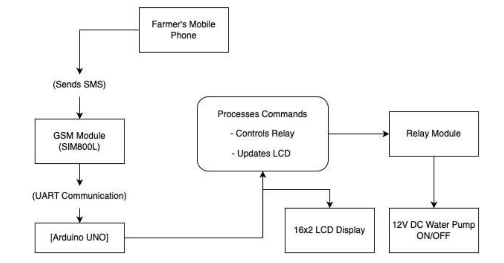
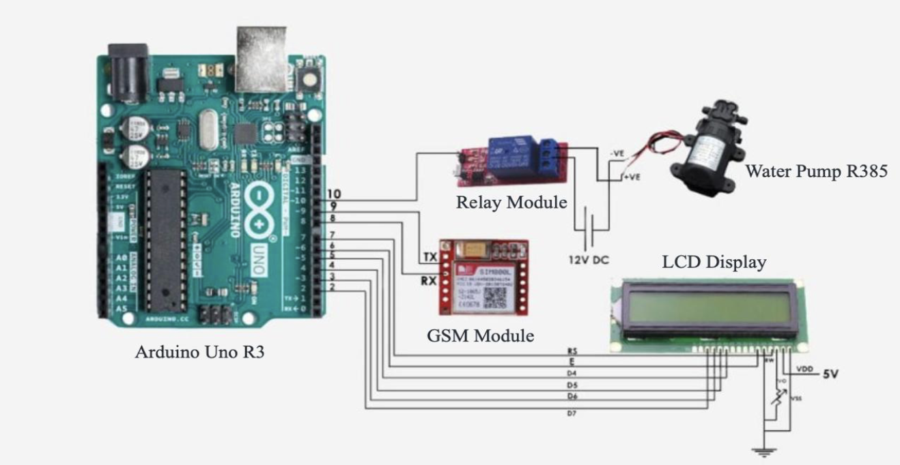
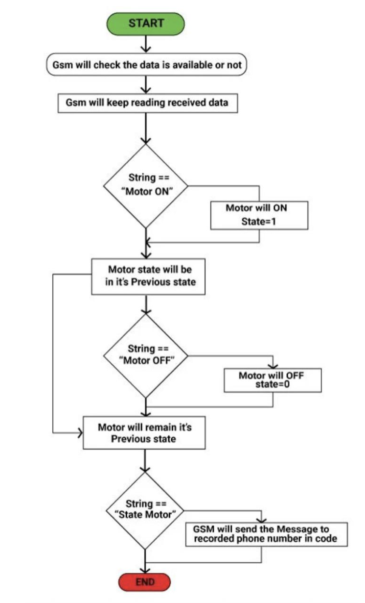
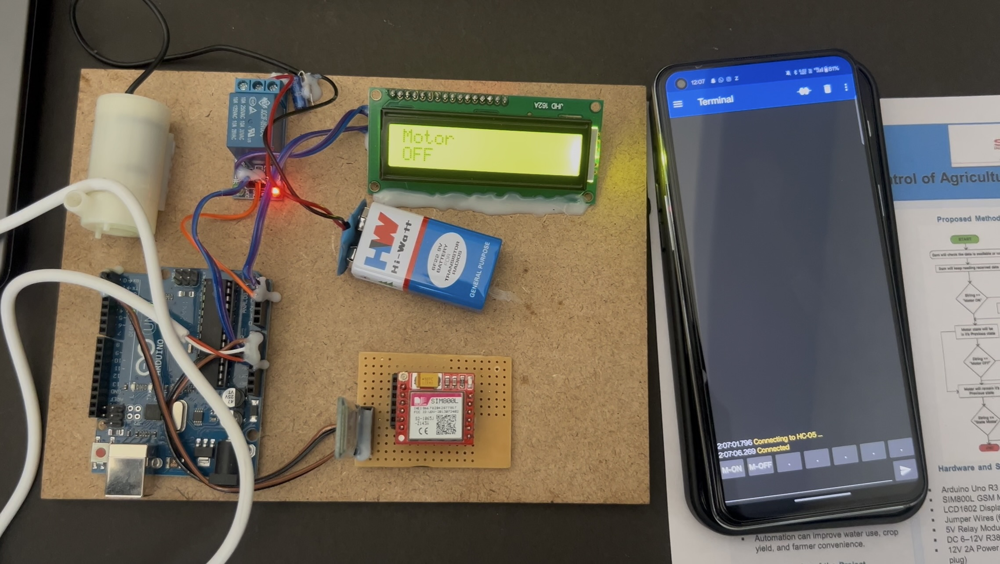
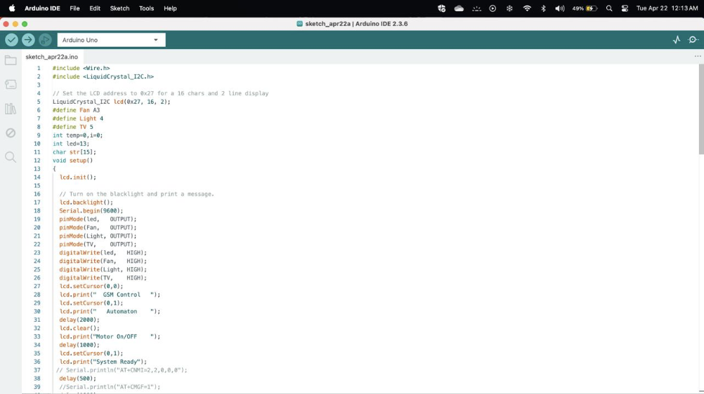

Remote Control of Agricultural Irrigation Motors Using GSM and Arduino
This project, developed at Sathyabama Institute of Science and Technology, provides a cost-effective and reliable system for farmers to remotely control agricultural irrigation motors using simple SMS commands. It eliminates the need for physical presence, saves time, conserves water, and is ideal for rural areas where internet connectivity is limited.

📍 The Problem
In traditional agriculture, farmers must travel to their fields, often over long distances, simply to switch irrigation pumps on or off. This manual process is inefficient, labor-intensive, and leads to wasted water and increased operational costs. There is a need for an accessible and affordable remote control solution to modernize these practices.

✨ Key Features
SMS-Based Control: Operate the irrigation motor from any standard mobile phone via text messages.

No Internet Required: Relies on the widely available GSM cellular network.

Real-Time Status Updates: The system provides status updates via the onboard LCD screen and can be configured to send confirmation SMS messages.

Low-Cost and Accessible: Built with affordable and readily available components like Arduino and a SIM800L module.

Scalable: The platform can be expanded with additional sensors and features.

⚙️ System Architecture and Design
The system is centered around an Arduino Uno, which acts as the brain. It processes commands received by the GSM module and controls a relay switch connected to the water pump.

Architecture Diagram

Circuit Diagram
The circuit connects the Arduino Uno to the SIM800L module for communication, a 16x2 LCD display for status messages, and a 5V relay module to safely switch the high-voltage water pump.

System Flow
The program logic waits for an incoming SMS. It parses the message to check for valid commands ("Motor ON", "Motor OFF", etc.) and then triggers the appropriate action.

🛠️ Hardware and Software Requirements
Hardware:

Arduino Uno R3

SIM800L GPRS/GSM Module

5V Single Channel Relay Module

16x2 LCD Display

12V DC Water Pump (for prototype)

Power Supply and Jumper Wires

Software:

Arduino IDE (v1.8.x or later)

🚀 Prototype and Implementation
Here is the final assembled prototype demonstrating the complete working system.

📋 How to Use
Assemble the circuit as shown in the diagram.

Upload the .ino source code to the Arduino Uno.

Insert an active SIM card into the GSM module and power on the system.

Send an SMS command to the SIM card's number to control the motor.

Example Command: #A.fan on* (based on the provided source code).

🔮 Future Enhancements
Soil Moisture Sensors: Enable fully automated irrigation based on soil conditions.

Mobile App: Develop a user-friendly mobile application for easier control and monitoring.

IoT Integration: Migrate to an IoT platform for advanced analytics and web-based control.

Solar Power: Implement a solar panel and battery system for off-grid operation.

🙏 Acknowledgments
We extend our gratitude to our supervisor, Dr. K. Veena, and the Department of Computer Science and Engineering at Sathyabama Institute of Science and Technology for their guidance and support.